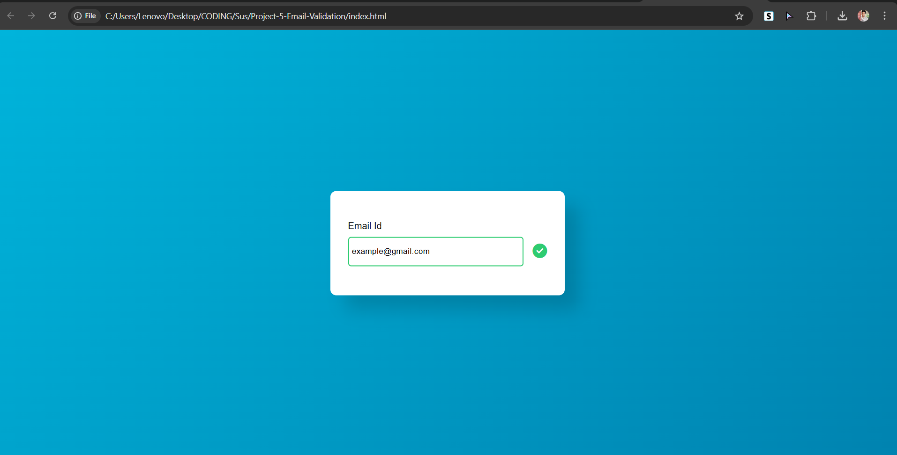

---  

# Email Validator 🔍✉️  

A simple yet effective **Email Validator** built using **HTML, CSS, and JavaScript**. This project helps users check whether an email address follows the correct format using real-time validation.  

## 🚀 Features  
✅ Instant validation feedback  
✅ Checks for proper email structure (e.g., `example@domain.com`)  
✅ User-friendly interface with a clean design  
✅ Lightweight and responsive  

## 🛠️ Technologies Used  
- **HTML** – Structure of the webpage  
- **CSS** – Styling for a modern UI  
- **JavaScript** – Logic for email validation  

## 🎯 How It Works  
1. Enter an email address in the input field.  
2. The script validates the format using **regular expressions (RegEx)**.  
3. Displays a success message if valid, or an error message if invalid.  

## 📷 Preview  


## 📂 Installation & Usage  
1. Clone this repository:  
   ```sh  
   git clone https://github.com/your-username/email-validator.git  
   ```  
2. Open `index.html` in your browser.  
3. Start validating emails! 🎉  

## 🤝 Contributing  
Feel free to fork this repository and submit pull requests. Any improvements are welcome!  

## 📜 License  
This project is licensed under the **MIT License**.  

---
